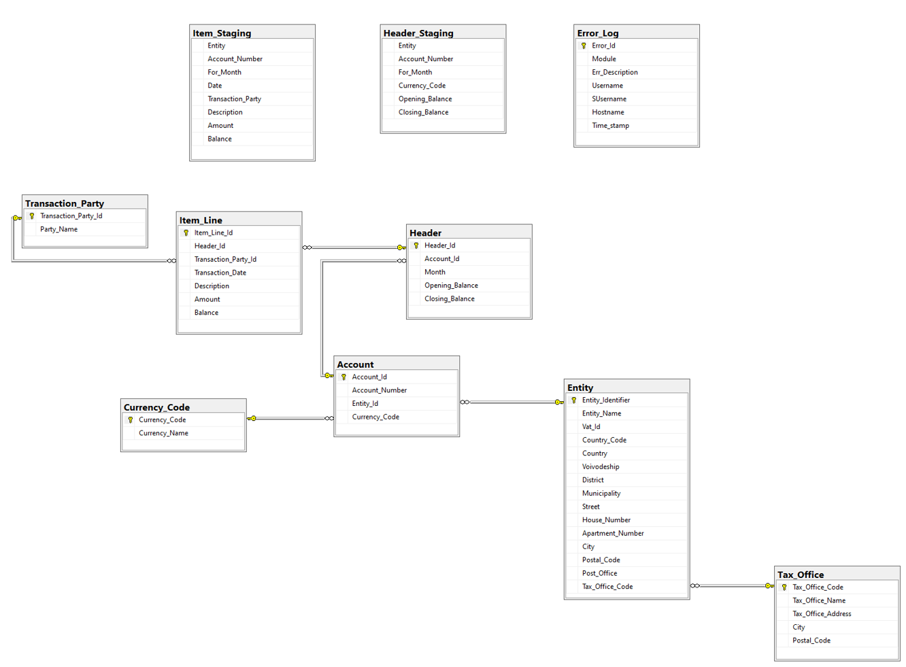
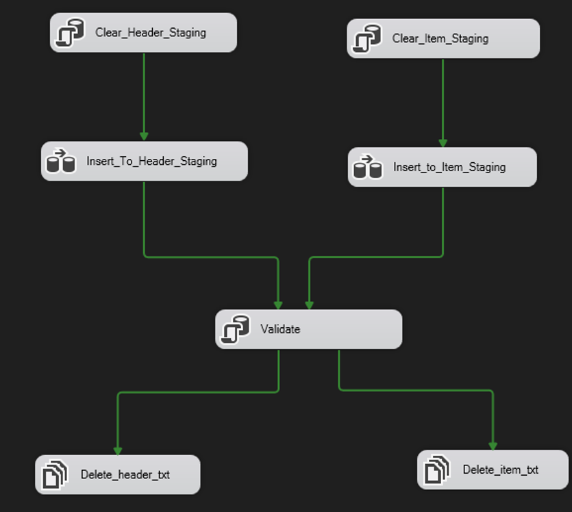

# Bank Operations Data Import and JPK_WB XML Reporting System

This project implements a system designed to import bank operation data, store it, and generate compliant XML reports as required by the Polish Ministry of Finance. It utilizes Microsoft SQL Server and SSIS (SQL Server Integration Services) for data processing, aiming to provide entities with a robust tool for managing and reporting their bank statements (Wyciągi Bankowe) to the Tax Office (Urząd Skarbowy).

## 1. Project Goal & Compliance
The primary goal of this project is to create a system that enables the import and reporting of bank operation data. It specifically adheres to the requirements set by the Ministry of Finance, following the structure defined in the Schemat_JPK_WB(1)_v1-0.xsd schema definition file. This compliance allows entities to store their bank operation data and generate bank statement reports in XML format, which can then be submitted to the Tax Office.

## 2. Functional Scope
The program is designed to perform the following key functions:
* Data Import: It reads data from two tab-delimited Unicode text files:
    * Header file: Contains information about the entity and its bank accounts.
    * Item file: Contains details of operations performed on bank accounts.
* Multi-Entity Support: The system supports importing data and reporting for multiple entities.
* Data Validation: During the import process, the system performs data correctness verification.
    * If data meets requirements, all data is imported.
    * If data is incorrect, it is rejected.
    * Headers are processed first, followed by their corresponding item lines.
* Data Storage: Imported data is persistently stored in a database.
* XML Export: Data stored in the database can be exported to an XML file that is compliant with Schemat_JPK_WB(1)_v1-0.xsd.

## 3. Technical Architecture
The project is implemented using the following technologies:
* Database: MS SQL Server 2022 managed with SQL Server Management Studio.
* ETL (Extract, Transform, Load): Data import is handled by an SSIS (SQL Server Integration Services) package developed in Visual Studio 2022.
* Source Files: Input data comes from two Text Tab Delimited Unicode text files (one for headers, one for items).
* XML Export: The export functionality is implemented via SQL procedures.

## 4. Data Model
The database schema includes the following tables:  

## 5. Implementation Overview
The core of the data processing is a single SSIS package. The process flow within the package is as follows:
1. Staging Table Cleanup: `The Clear_Header_Staging` and `Clear_Item_Staging` tasks clear any existing data from the temporary staging tables.
2. Data Loading to Staging: Two Data Flow Tasks, `Insert_To_Header_Staging` and `Insert_to_Item_Staging`, are responsible for loading data from the raw text files into their respective staging tables.
3. Validation and Import: Upon successful completion of the staging tasks, the package executes a function that performs comprehensive data validation and then imports the validated data into the final target tables.
4. Post-Processing: If the entire operation (staging, validation, and import) is successful, the data is confirmed to be in the target tables, and the source text files are deleted.
5. Error Termination: If any validation or import errors occur, an appropriate error message is displayed, and the execution of the package is halted. The system is designed such that any error rejects the entire import.  

Detailed validation logic for both headers and item lines, including checks for balances, account numbers, and dates, ensures data quality before final insertion. A transaction is used to guarantee atomicity of data insertion; if validation fails or an error occurs during insertion, the transaction is rolled back.

SSIS package architecture is shown below.  

## 6. Usage
### Importing Data
The SSIS package can be executed using the dtexec.exe utility:  
`dtexec.exe /F .\Header_Item_Import.dtsx`  
A successful import will be indicated by a success message. The sources include examples of correct header.txt and item.txt files for reference.
### Exporting to XML
To generate the JPK_WB XML file, a SQL procedure is used. The code for this procedure is located in `export_xml.sql`. This procedure allows the export of selected data into the XML format compliant with the Ministry of Finance's JPK_WB schema. An example of the generated XML structure is provided in the sources.

## 7. Setup
To set up the project, one would need to:
1. Database Setup: Execute the SQL script located in db_setup.sql. This file contains the code necessary to create the database tables and populate them with example data.
2. SSIS Package Deployment: Deploy the SSIS package to your SQL Server Integration Services Catalog or run it directly from Visual Studio. Change of source file paths might be needed.
3. Source Files: Ensure your input header.txt and item.txt files are correctly formatted (Tab Delimited Unicode) and accessible by the SSIS package.